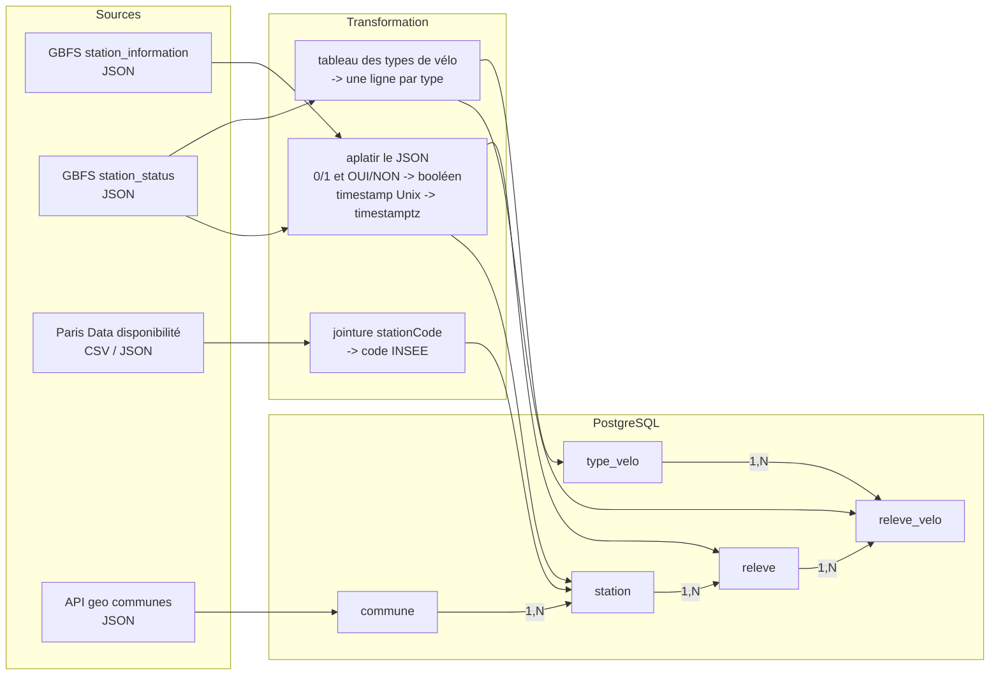

# TP Audit & cartographie des données : les stations Vélib'

## Sujet

**Thème : transport**, avec les vélos en libre-service Vélib' Métropole (Paris et une soixantaine de communes autour).

**Contexte** : il y a environ 1 500 stations Vélib'. Leur état (vélos dispo, bornes libres) est publié en open data, en temps réel. En revanche l'info est éclatée entre plusieurs sources qui n'ont pas le même format ni les mêmes identifiants.

**Problématique** : comment rassembler ces données pour pouvoir suivre dans le temps la disponibilité des vélos, par station et par commune ? Par exemple, savoir quelles communes manquent de vélos électriques le matin, ou quelles stations sont souvent pleines.

**Objectif** : cartographier les sources, les documenter, en tirer un modèle relationnel puis une base PostgreSQL qui garde l'historique des relevés.

## Sources de données

| | Source 1 | Source 2 | Source 3 |
|---|---|---|---|
| **Nom** | Vélib' Métropole – flux GBFS (`station_information`, `station_status`) | Vélib' – Disponibilité en temps réel | API Découpage administratif – communes |
| **Organisation** | Smovengo, pour le syndicat Autolib' Vélib' Métropole | Ville de Paris (Paris Data) | DINUM / Etalab (API geo.gouv) |
| **URL** | https://velib-metropole-opendata.smovengo.cloud/opendata/Velib_Metropole/gbfs.json | https://opendata.paris.fr/explore/dataset/velib-disponibilite-en-temps-reel/ | https://geo.api.gouv.fr/decoupage-administratif/communes |
| **Format** | JSON | CSV, JSON, Excel, GeoJSON (export) + API | JSON (API REST) |
| **Nature** | Semi-structurée (objets imbriqués, tableau de types de vélos) | Structurée (une ligne par station), sauf le champ géo | Semi-structurée (liste de codes postaux dans chaque commune) |
| **Description** | Standard international GBFS. Un fichier pour les infos fixes des stations (nom, position, capacité), un autre pour l'état en temps réel, mis à jour toutes les minutes environ. | Le même état temps réel mais à plat, enrichi avec la commune et son code INSEE. | Référentiel officiel des communes : code INSEE, nom, département, population, surface. |

Ce que chaque source apporte au modèle :
- GBFS : les stations et les relevés (source principale).
- Paris Data : le lien station → commune (le GBFS ne le donne pas).
- API geo : les infos sur les communes.

Les clés de jointure : `stationCode` entre le GBFS et Paris Data, `code_insee_commune` entre Paris Data et l'API geo.

## Contenu du dépôt

```
docs/dictionnaire.md      dictionnaire de données + remarques qualité
docs/modeles.md           entités, relations, cardinalités, MCD et modèle logique
modele/velib.dbml         modèle logique au format dbdiagram.io
modele/velib.svg          export du diagramme
sql/01_schema.sql         création des tables et contraintes
sql/02_donnees_test.sql   données de test (vrai extrait du 24/09/2026)
sql/03_verifications.sql  requêtes de contrôle des relations
```

## Lancer la base

```bash
createdb velib
psql -d velib -f sql/01_schema.sql
psql -d velib -f sql/02_donnees_test.sql
psql -d velib -f sql/03_verifications.sql
```

Ou sans rien installer, avec Docker :

```bash
docker run -d --name pgvelib -e POSTGRES_PASSWORD=pg -e POSTGRES_DB=velib -v "$PWD/sql":/sql postgres:16
docker exec pgvelib psql -U postgres -d velib -f /sql/01_schema.sql -f /sql/02_donnees_test.sql -f /sql/03_verifications.sql
```

Les données de test : 4 communes, 12 stations (3 par commune), 2 collectes à 2 minutes d'intervalle, donc 24 relevés et 48 lignes de détail par type de vélo. Les requêtes de `03_verifications.sql` montrent les jointures sur toute la chaîne et les insertions qui doivent être refusées (FK, CHECK, UNIQUE).

## Cartographie globale



En résumé : données brutes (JSON / CSV) → audit et dictionnaire → entités et relations → MCD → modèle logique (dbdiagram) → script PostgreSQL → contrôles.
