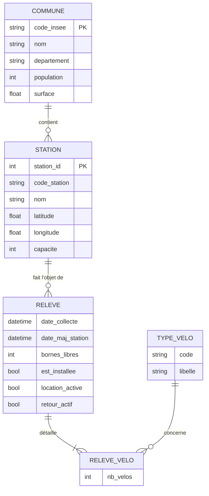
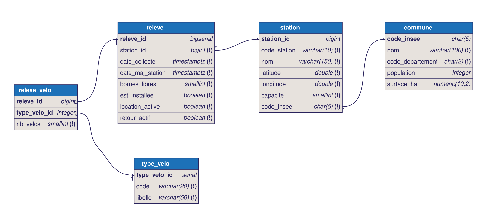

# Entités, relations et modèles

## Entités retenues

| Entité | Attributs | Identifiant | D'où ça vient |
|---|---|---|---|
| COMMUNE | nom, département, population, surface | code INSEE | API geo + code_insee_commune de Paris Data |
| STATION | code station, nom, latitude, longitude, capacité | station_id | station_information (GBFS) |
| RELEVE | date de collecte, date de maj station, bornes libres, installée, location active, retour actif | id auto | station_status (GBFS) |
| TYPE_VELO | code, libellé | id auto | clés du tableau `num_bikes_available_types` |

## Relations et cardinalités

```
COMMUNE   1 ───── N STATION
STATION   1 ───── N RELEVE
RELEVE    N ───── N TYPE_VELO   (porteur : nb_velos)
```

- COMMUNE – STATION : une station est dans une seule commune, une commune a plusieurs stations (994 pour Paris, 30 pour Boulogne...). Côté station c'est (1,1), côté commune (0,N) car on peut charger des communes du département sans station Vélib'.
- STATION – RELEVE : l'état d'une station change tout le temps, donc on ne peut pas mettre les vélos dispo dans STATION, sinon on écrase l'historique à chaque collecte. Un relevé = une station à un instant. (1,1) côté relevé, (0,N) côté station (station toute neuve pas encore relevée).
- RELEVE – TYPE_VELO : dans le flux c'est un tableau `[{"mechanical": 8}, {"ebike": 1}]`. Plutôt que deux colonnes figées, on en fait une association avec le nombre de vélos comme attribut. Si Vélib' ajoute un type (vélo cargo par ex.) il suffit d'ajouter une ligne dans TYPE_VELO. C'est la seule N-N du modèle, elle devient la table `releve_velo`.

Choix écartés :
- les codes postaux (tableau dans l'API geo) : pas utiles pour le sujet, et Paris en a 21 pour un seul code INSEE, ça aurait demandé une table en plus pour rien.
- une entité DEPARTEMENT : un simple code suffit ici, on n'a aucune autre info sur le département.
- `num_bikes_available` : c'est la somme des types, donc calculable, pas stocké.

## Modèle conceptuel



## Modèle logique

Le fichier [`modele/velib.dbml`](../modele/velib.dbml) se colle directement dans dbdiagram.io.



```
commune (code_insee PK, nom, code_departement, population, surface_ha)

station (station_id PK, code_station UNIQUE, nom, latitude, longitude, capacite,
         #code_insee FK -> commune)

type_velo (type_velo_id PK, code UNIQUE, libelle)

releve (releve_id PK, #station_id FK -> station, date_collecte, date_maj_station,
        bornes_libres, est_installee, location_active, retour_actif)
        UNIQUE (station_id, date_collecte)

releve_velo (#releve_id FK -> releve, #type_velo_id FK -> type_velo, nb_velos)
        PK (releve_id, type_velo_id)
```

Pour la clé de STATION j'ai pris le `station_id` du GBFS parce que c'est lui qui relie station_information et station_status. Le `stationCode` reste unique : c'est lui qui sert à faire le lien avec le jeu Paris Data (qui n'a pas le station_id).
