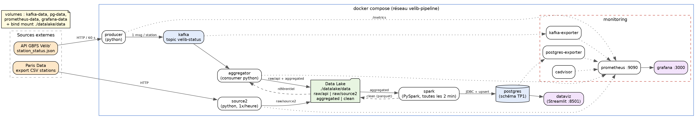

# TP2 - Pipeline data temps réel Vélib'

Suite du TP1 : on garde le même sujet (disponibilité des Vélib') et le même modèle de données, mais cette fois les données arrivent en continu et tout est automatisé avec Docker Compose.

## Architecture



(source du schéma : [docs/architecture.dot](docs/architecture.dot))

Le chemin d'une donnée :

```
API GBFS -> producer -> Kafka -> aggregator (+ CSV Paris Data) -> Data Lake -> PySpark -> PostgreSQL -> Streamlit
                                                     Prometheus -> Grafana (monitoring de tout ça)
```

## Les deux sources

**Source 1 - API GBFS Vélib' (`station_status.json`)**
- URL : https://velib-metropole-opendata.smovengo.cloud/opendata/Velib_Metropole/station_status.json
- JSON, semi-structuré, mis à jour environ toutes les minutes
- Rôle : l'état en temps réel de chaque station (vélos mécaniques / électriques, bornes libres, station ouverte ou non)
- Collecte : le `producer` appelle l'API toutes les 60 s et envoie un message Kafka par station (≈ 1500 messages / minute) dans le topic `velib-status`, avec la station comme clé.

**Source 2 - Référentiel des stations (open data Paris Data, CSV)**
- URL : https://opendata.paris.fr/explore/dataset/velib-disponibilite-en-temps-reel/ (export CSV, colonnes stationcode, name, capacity, coordonnees_geo, nom_arrondissement_communes, code_insee_commune)
- CSV séparé par `;`, avec BOM, coordonnées dans une seule colonne "lat, lon"
- Rôle : donner à chaque station son nom, sa capacité, sa position et surtout sa commune. L'API ne donne que des identifiants et des compteurs.
- Collecte : le service `source2` télécharge le fichier toutes les heures (ces infos changent peu) et le dépose tel quel dans le data lake.

Le lien entre les deux : le code station (`stationCode` dans l'API, `stationcode` dans le CSV).

## Choix techniques

- **Kafka** (image officielle apache/kafka, mode KRaft donc pas de Zookeeper) : 1 broker, topic à 3 partitions, rétention 24 h. Suffisant pour ~1500 messages/min.
- **Agrégation** : un consumer Python (`aggregation/aggregator.py`). Il lit Kafka par paquets d'une minute et joint chaque message avec le dernier CSV de la source 2. Besoin métier : sans la jointure on ne sait pas dans quelle commune est une station, ni sa capacité, donc pas de taux de remplissage ni d'analyse par commune. Les offsets Kafka sont validés après l'écriture des fichiers : pas de perte, mais des doublons possibles, gérés par Spark.
- **Data Lake** : un dossier partagé entre les conteneurs (`./datalake/data`), découpé en zones et partitionné par date. Pour un seul poste c'était plus simple qu'un MinIO, et on voit directement les fichiers. Détail des zones dans [datalake/README.md](datalake/README.md).
- **PySpark** : job batch relancé toutes les 2 minutes (`spark/run.sh`). Il ne relit que les fichiers pas encore traités.
- **PostgreSQL** : le schéma du TP1 (commune, station, releve, type_velo, releve_velo) + une table `pipeline_run` qui trace chaque exécution Spark.
- **Data viz** : Streamlit. Le dashboard est du code Python, donc il est prêt dès le `docker compose up` (Metabase ou Superset demandent une config à la main). Il y a aussi une recherche par adresse : l'adresse est géocodée avec l'API de la Géoplateforme IGN (https://data.geopf.fr/geocodage/search) et on affiche les stations dans le rayon choisi avec leurs vélos dispo.
- **Monitoring** : Prometheus + Grafana, avec cAdvisor (conteneurs), postgres-exporter, kafka-exporter et des métriques exposées directement par nos scripts Python (`prometheus_client`).

## Traitement PySpark

Dans `spark/job.py` :
- lecture de la zone `aggregated` avec un schéma imposé (tout en texte), puis cast de chaque colonne (entiers, double, timestamps) ;
- conversion : `last_reported` (timestamp Unix) en date, 0/1 en booléens, découpage de `coordonnees_geo` en latitude / longitude ;
- normalisation : trim, espaces en double dans les noms, code INSEE sur 5 caractères ;
- valeurs manquantes : un type de vélo absent = 0 vélo ; les lignes sans station connue, sans commune ou sans position sont rejetées ;
- incohérences : capacité à 0 rejetée (il y a 3 stations dans ce cas, fermées) ;
- doublons : un seul relevé par (station, date de collecte) ;
- écriture de la version propre en parquet dans `clean/`, puis chargement dans postgres via une table tampon `stg_releve` et des `INSERT ... ON CONFLICT` (communes, stations mises à jour, relevés, vélos par type).

## Lancer le projet

Prérequis : Docker avec Docker Compose, et un accès internet (les deux sources sont en ligne).

```
cd TP2
docker compose up -d
```

Au premier lancement, il faut compter environ 3-4 minutes avant d'avoir des données dans PostgreSQL : premier appel API, premier paquet de l'agrégateur (1 min), puis premier passage de Spark.

| Service | URL |
|---|---|
| Dashboard Streamlit | http://localhost:8501 |
| Grafana (lecture sans login, admin / admin pour modifier) | http://localhost:3000 |
| Prometheus | http://localhost:9090 |
| PostgreSQL | localhost:5432, base `velib`, user `velib` / `velib` |

Pour tout arrêter : `docker compose down` (ajouter `-v` pour supprimer aussi les volumes ; le data lake est dans `datalake/data`, à vider à la main).

## Vérifier chaque étape

```
# 1. collecte : le producer envoie bien les stations
docker compose logs -f producer

# 2. kafka : lire quelques messages du topic
docker compose exec kafka /opt/kafka/bin/kafka-console-consumer.sh --bootstrap-server localhost:9092 --topic velib-status --max-messages 3

# 3. data lake
ls datalake/data/raw/api/* datalake/data/aggregated/*

# 4. spark
docker compose logs spark | grep lignes

# 5. postgres
docker compose exec postgres psql -U velib -d velib -c "select * from pipeline_run order by run_id desc limit 5"
docker compose exec postgres psql -U velib -d velib -c "select count(*) from releve"
```

## Monitoring

Le dashboard Grafana "Vélib' - pipeline & monitoring" est chargé automatiquement (provisioning). Il y a 3 parties :

- **Pipeline data** : lignes brutes dans le data lake, lignes lues par Spark, lignes chargées dans PostgreSQL, taux clean/raw, lignes en attente de traitement, âge du dernier job Spark, débit Kafka (envoyés / reçus / consommés) et lag du consumer.
- **Infrastructure** : état UP/DOWN de chaque service scrapé, CPU et mémoire par conteneur (cAdvisor).
- **PostgreSQL** : disponibilité, taille de la base, nombre de stations / communes / relevés, connexions, commits et insertions par seconde.

Indicateur raw vs clean : `velib_datalake_raw_records` (compté par l'agrégateur) contre `velib_pipeline_lignes_chargees` (lu dans la table `pipeline_run` par postgres-exporter). L'écart s'explique par les lignes en attente de Spark, les lignes rejetées et les doublons, qui sont aussi affichés.

Remarque : sur Docker Desktop (Mac) avec le "containerd image store" activé, cAdvisor n'arrive pas à récupérer le nom des conteneurs. Les courbes CPU / mémoire s'affichent quand même, mais avec l'id du conteneur. Sur un Docker Linux classique les noms apparaissent.

## Arborescence

```
TP2/
├── docker-compose.yml
├── api/            producer Kafka (source 1)
├── source2/        téléchargement du CSV Paris Data
├── aggregation/    consumer Kafka + jointure avec la source 2
├── datalake/       data lake (data/ est créé au lancement)
├── spark/          job PySpark + boucle de lancement
├── postgres/       script d'init (schéma du TP1 + tables du pipeline)
├── dataviz/        dashboard Streamlit
├── monitoring/     prometheus, requêtes postgres-exporter, grafana (datasource + dashboard)
└── docs/           schéma d'architecture
```
